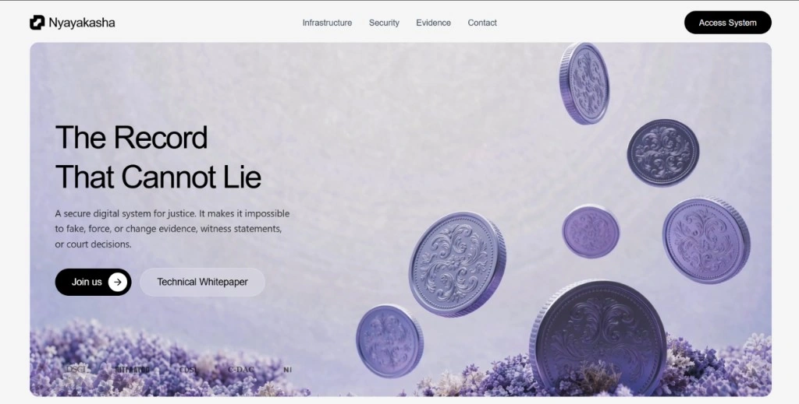

# NYAYAKASHA

**A Blockchain-Powered Judicial Evidence Management Platform**

## 1. Problem Statement

India’s judicial system handles millions of criminal, civil, and property-related cases every year. However, many cases are **delayed, disputed, or even decided incorrectly** because the justice process depends heavily on evidence and witness testimonies that can be **tampered with, forged, manipulated, or influenced** before reaching the court. The **absence of a secure, transparent, and verifiable evidence management system** weakens trust in judicial outcomes and slows the delivery of justice.

### Scale/Impact
Millions of pending court cases create significant judicial backlog.
- Thousands of criminal, civil, and property disputes are filed every day.
- Evidence-related issues significantly increase investigation time and court delays.
- Manual verification and documentation consume valuable judicial resources.
- A single tampered document or evidence can affect the outcome of an entire case.

### India's Legal System Impacts
- Court cases take much longer to resolve.
- Wrong judgments become more likely.
- Public trust in the legal system decreases.
- Victims may not receive timely justice.
- Innocent individuals may be wrongly convicted.
- Government resources are repeatedly spent on appeals and prolonged legal disputes.

### Why Securing the Judicial System Remains Unsolved
1. Cannot Confirm Original Evidence
2. Forgery and Deepfake Detection Gap
3. Lack of Secure Witness Protection
4. Broken Evidence Chain

### Who Is Affected?
- **Police & Investigators:** Difficult custody chain, slower investigations.
- **Judiciary:** Judges spend time verifying evidence, increasing workload.
- **Citizens (Victims & Accused):** Delayed justice for victims, innocent face accusations.
- **Lawyers & Legal Counsel:** Lawyers must repeatedly verify evidence, causing delays.
- **State & Government:** Rising judicial expenses and appeals, reduced confidence.
- **Property Owners & Witnesses:** Property owners vulnerable to fraud; witnesses fear testifying.

### Problem Summary
The current judicial ecosystem lacks a unified mechanism to ensure evidence authenticity, preserve an immutable chain of custody, protect witness identity, and detect AI-generated forgeries. These shortcomings lead to delayed justice, wrongful judgments, reduced public trust, increased litigation costs, and inefficient use of judicial resources.

---

## 2. Proposed Solution

**NYAYAKASHA** is a blockchain-powered judicial evidence management platform that secures the entire lifecycle of a case—from evidence collection and witness testimony to document verification and court records. It combines blockchain, AI, and advanced cryptography to ensure that evidence remains authentic, tamper-proof, traceable, and privacy-preserving throughout the judicial process.

### Core Features
- **Tamper-Proof Evidence Capture (PRAMANA):** Evidence is secured at the moment of collection using cryptographic hashing, timestamps, GPS location, and digital signatures, creating an immutable chain of custody from crime scene to courtroom.
- **AI-Based Forgery & Deepfake Detection (MAYA-BREAK):** Advanced AI automatically detects forged documents, manipulated images, deepfake videos, and altered evidence before it is admitted into the judicial process.
- **Privacy-Protected Witness Testimony:** Zero-Knowledge Proof (ZKP) technology allows witnesses to verify their testimony while keeping their identity confidential until legally disclosed by the court.
- **Immutable Blockchain Case Ledger:** Every action—evidence upload, document verification, testimony, and judicial record—is permanently recorded on a blockchain ensuring complete transparency and preventing unauthorized modifications.
- **Secure Judicial Analytics:** Privacy-preserving encrypted analytics identify unusual case trends, potential bias, or suspicious judicial patterns without exposing confidential case information, helping improve transparency and accountability.

---

## 3. Innovation & Differentiators

### Key Differentiators
- **Differentiator 1:** Unlike existing systems that only secure records after upload, NYAYAKASHA protects evidence from the **moment it is collected** using cryptographic hashing, timestamps, GPS verification, and blockchain, ensuring an unbroken chain of custody.
- **Differentiator 2:** Our solution combines **AI-powered forgery/deepfake detection** with **Zero-Knowledge Proofs (ZKP)** for witness testimony, enabling secure verification while protecting witness identities until legally authorized.
- **Differentiator 3:** NYAYAKASHA integrates **immutable blockchain records**, encrypted judicial analytics, and quantum-resistant cryptography to improve transparency, detect anomalies, and ensure long-term security against emerging cyber threats.

### Vs Existing Solutions

| Feature | Existing Solutions | Our Solution |
| :--- | :---: | :---: |
| End-to-End Tamper-Proof Evidence Chain | ❌ | ✅ |
| AI-Based Forgery & Deepfake Detection | ❌ | ✅ |
| Privacy-Protected Witness Testimony (ZKP) | ❌ | ✅ |
| Immutable Blockchain Audit Trail | ⚠️ Partial | ✅ |
| Secure Judicial Analytics | ❌ | ✅ |
| Quantum-Resistant Security | ❌ | ✅ |

---

## 4. Impact & Benefits

### Expected Impact
NYAYAKASHA strengthens the justice system by ensuring tamper-proof evidence, secure witness protection, and transparent judicial records. By reducing evidence manipulation, document forgery, and procedural delays, it helps improve judicial efficiency, increase convict accuracy, and restore public trust in the legal system.

### Target Users
- Judiciary (Courts & Judges)
- Police & Investigation Agencies
- Forensic Laboratories
- Government Legal Departments
- Lawyers & Citizens involved in legal proceedings

### Scale / Reach
Designed for district courts, High Courts, and government investigation agencies across India, with the potential to scale nationally. The platform can support millions of case records and evidence transactions, making it suitable for India's large judicial ecosystem.

### Key Benefits
- **Reduced Costs:** Repeated investigations and document verification costs reduced.
- **Fewer Legal Expenses:** Fraud-related costs and admin workload minimized.
- **Saved Judicial Time:** Automated validation & secure digital workflows.
- **Promotes Transparent Justice:** Promotes fair, transparent, accountable processes; builds confidence.
- **Protects Rights & SDG 16:** Protects witness testimonies, safeguards rights, and supports SDG 16.

---

## 5. Market Research

### Key Competitors & Limitations
- **e-Courts (India):** Digital case management and workflow, but no tamper-proof evidence management or AI verification.
- **JudiciaryChain:** Post-upload blockchain storage of records, but lacks source-level evidence verification and witness privacy.
- **State Land Registry Projects:** Limited to property records and does not support criminal investigations, witness protection, or judicial analytics.

### The Critical Market Gap
Existing solutions primarily focus on digitizing records. NYAYAKASHA secures the entire justice lifecycle—from evidence collection and verification to witness protection, immutable record keeping, and intelligent judicial analytics.

### Nyayakasha Value Proposition
- Comprehensive, next-generation judicial infrastructure for source-to-court security.
- End-to-End Evidence Authenticity
- Witness Privacy
- AI-based Forgery Detection
- Secure Judicial Analytics

### Market Opportunity
Indian Judiciary's rapid digitization creates critical security and authenticity gaps across all institutions.

### Scalability
Cloud-native, API-driven architecture enabling deployment across multiple institutions and high transaction volumes.

### Target Customers
- Public Courts (District to Supreme)
- Tribunals
- Police & Investigation Agencies (for secure evidence handling)
- Judicial Analytics Units

### Our Competitive Advantages
- End-to-End Tamper-Proof Evidence Chain
- Privacy-Protected Witness Testimony (ZKP)
- AI-Based Forgery & Deepfake Detection
- Immutable Blockchain Audit Trails with Intelligent Analytics
